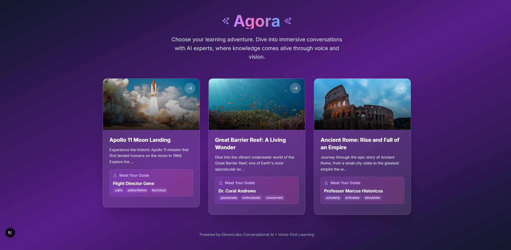
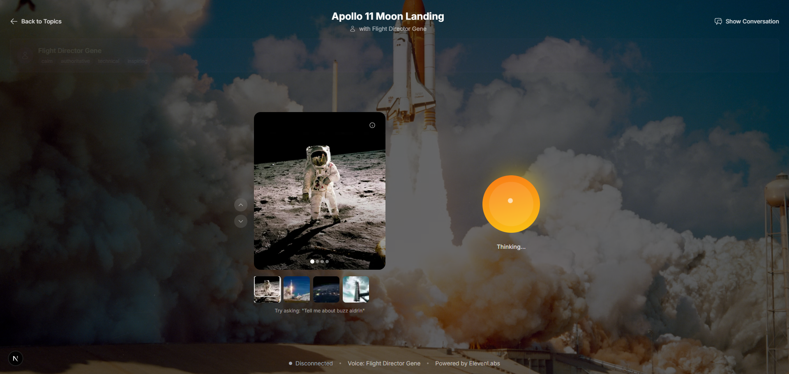
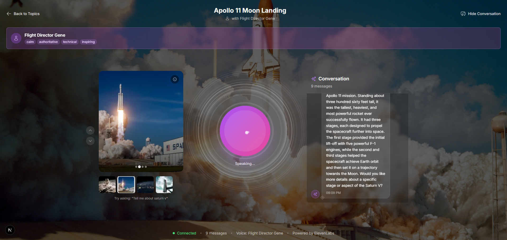

# Agora - Voice-First Learning Platform

> **"Where every conversation becomes a journey of discovery"**

An immersive Next.js 13 application that reimagines learning through AI-powered voice conversations. Agora transforms static topics into dynamic, character-driven experiences where users don't just learn—they explore, question, and discover through natural dialogue.

## 🏛️ Why "Agora"?

The name **Agora** (ἀγορά) comes from ancient Greece, where it was the central gathering place—a marketplace of ideas where citizens would meet to discuss philosophy, politics, art, and knowledge. It was more than just a physical space; it was the heartbeat of democratic learning and intellectual exchange.

**Agora** represents our vision: a digital marketplace of ideas where learners gather to engage in meaningful conversations with AI experts. Just as the ancient Agora brought together diverse perspectives and fostered deep understanding through dialogue, our platform creates spaces where knowledge isn't just transmitted—it's discovered through conversation, questioning, and exploration.

*Every voice session is your personal Agora—a place where learning becomes a collaborative journey of discovery.*

## 🎯 The Vision

Agora isn't just another learning app. It's a **conversation-first platform** that makes complex topics accessible through engaging AI personas. Whether you're exploring the depths of the ocean with a passionate marine biologist or walking the streets of ancient Rome with a wise historian, every interaction feels personal, memorable, and genuinely educational.

## 📸 Screenshots

### Home Screen - Topic Selection

*Beautiful topic selection interface with immersive character previews*

### Voice Session Interface  

*Clean, voice-first conversation interface with animated orb and visual feedback*

### Learning Experience

*Immersive learning with character-driven conversations and contextual visuals*

## ✨ What Makes Agora Special

### 🎭 Character-Driven Learning
- **Distinct AI Personas**: Each topic features a unique expert with their own personality, voice, and teaching style
- **Immersive Storytelling**: Learning becomes a narrative experience, not just information consumption
- **Emotional Connection**: Users form relationships with AI guides, making learning stick

### 🧠 Intelligent Knowledge Integration
- **RAG-Powered Conversations**: Real-time retrieval of relevant information from comprehensive knowledge bases
- **Context-Aware Responses**: AI understands conversation flow and provides contextual insights
- **Dynamic Knowledge Loading**: Each session is configured with topic-specific expertise

### 🎨 Visual Learning Enhancement
- **Interactive Image Carousels**: Visual context that evolves with conversation topics
- **Cinematic Backgrounds**: Immersive environments that set the mood for each learning journey
- **Responsive Visual Feedback**: UI elements that respond to conversation state and user engagement

## 🚀 Core Features

### Voice-First Experience
- **Natural Conversations**: Seamless voice interaction using ElevenLabs Conversational AI
- **Animated Conversation Orb**: Visual feedback for listening, thinking, and speaking states
- **No Text Interface**: Pure voice-driven interaction for authentic learning experiences

### Knowledge Base System
- **Pre-configured Expertise**: Rich knowledge bases for each topic with detailed information
- **Smart Retrieval**: AI automatically selects relevant information based on user queries
- **Topic-Specific Configuration**: Each conversation is dynamically configured with relevant knowledge

### Immersive UI/UX
- **Smooth Animations**: Framer Motion-powered transitions for premium feel
- **Responsive Design**: Beautiful experience across all devices
- **Progressive Enhancement**: Graceful degradation for different capabilities

## 🎭 Meet Your AI Guides

### 🚀 Flight Director Gene - Apollo 11 Moon Landing
*"Every mission is a story of human courage and technological triumph"*
- **Voice**: Calm, authoritative, inspiring
- **Expertise**: Space technology, mission details, astronaut experiences
- **Teaching Style**: Technical yet accessible, with a focus on human achievement

### 🐠 Dr. Coral Andrews - Great Barrier Reef
*"The ocean holds secrets that can change how we see our world"*
- **Voice**: Passionate, enthusiastic, concerned
- **Expertise**: Marine biology, coral ecosystems, conservation
- **Teaching Style**: Story-driven, with deep emotional connection to the subject

### 🏛️ Professor Marcus Historicus - Ancient Rome
*"History isn't just dates and names—it's the story of human civilization itself"*
- **Voice**: Scholarly, articulate, wise
- **Expertise**: Roman history, politics, engineering, daily life
- **Teaching Style**: Narrative-focused, connecting past to present

## 🛠️ Quick Start

### Prerequisites
- Node.js 18+
- ElevenLabs account with API key
- ElevenLabs Conversational AI agent

### 🔑 ElevenLabs API Setup

Before you can use Agora, you need to obtain API credentials from ElevenLabs:

#### Step 1: Create ElevenLabs Account
1. **Sign up** at [ElevenLabs](https://elevenlabs.io/)
2. **Verify your email** and complete account setup
3. **Choose a plan** - Free tier available for testing, paid plans for production use

#### Step 2: Get Your API Key
1. **Go to Profile Settings** in your ElevenLabs dashboard
2. **Navigate to the API tab**
3. **Copy your API Key** (starts with `sk_`)
4. **Keep it secure** - treat it like a password

#### Step 3: Create Conversational AI Agent
1. **Go to Conversational AI** section in ElevenLabs dashboard
2. **Click "Create Agent"** 
3. **Configure basic settings**:
   - Name: "Agora Learning Assistant" (or your preference)
   - Description: "AI assistant for educational conversations"
4. **Copy the Agent ID** (starts with `agent_`)
5. **Keep this ID** - you'll need it for configuration

### Technology Stack
- **Frontend**: Next.js 14, React 18, TypeScript
- **Styling**: Tailwind CSS, Framer Motion  
- **AI Integration**: ElevenLabs Conversational AI
- **Package Manager**: npm

### Setup in 3 Steps

1. **Clone & Install**
```bash
git clone <repository-url>
cd agora
npm install
```

2. **Configure Environment**
```bash
# Copy and configure environment variables
cp .env.example .env.local
# Then edit .env.local with your actual values from ElevenLabs setup:
# ELEVENLABS_API_KEY=sk_your_actual_api_key_from_step_2
# ELEVENLABS_AGENT_ID=agent_your_actual_agent_id_from_step_3
```

3. **Launch & Explore**
```bash
npm run dev
# Open http://localhost:3000
```

### Verify Your Setup
After completing the setup, verify everything works:

1. **Check Environment**: Ensure `.env.local` has valid credentials
2. **Test API Connection**: Visit `/api/conversation` - should return setup status
3. **Start a Session**: Choose any topic and try a voice conversation

**Common Issues:**
- **"API key invalid"** → Check ElevenLabs dashboard for correct key
- **"Agent not found"** → Verify ELEVENLABS_AGENT_ID in dashboard
- **"Document not found"** → Ensure document IDs match your knowledge base
- **Voice not working** → Check browser microphone permissions

### Knowledge Base Setup in ElevenLabs Dashboard

Before you can use Agora, you need to set up the knowledge base in your ElevenLabs dashboard:

#### Step 1: Create and Configure Your Agent

1. **Create a new Conversational AI agent** in your ElevenLabs dashboard
2. **Enable RAG** in your agent settings
3. **Go to Security tab** and enable:
   - First Message
   - System Prompt
   - Voice
   - Text Only

#### Step 2: Add Knowledge Base URLs

1. **Go to Knowledge Base** section in your agent
2. **Click "Add URL"** and add these 3 URLs one by one:
   - `https://en.wikipedia.org/wiki/Apollo_11`
   - `https://en.wikipedia.org/wiki/Great_Barrier_Reef`
   - `https://en.wikipedia.org/wiki/Ancient_Rome:_The_Rise_and_Fall_of_an_Empire`

3. **ElevenLabs will generate document IDs** for each URL you add

#### Step 3: Update Document IDs in Code

After adding the URLs, you'll get unique document IDs. Update these in your `src/app/data/topics.ts` file:

```typescript
// Replace the documentId for each topic with your generated IDs
// For example:
documentId: '1E76UlAEQLStPYmAvrpN' // Replace with your Apollo 11 document ID
documentId: 'EElIWXO4VsfeR7oAHmjq' // Replace with your Great Barrier Reef document ID  
documentId: 'iQMjap18i11sXfTZBuLY' // Replace with your Ancient Rome document ID
```

**You are now ready to go!** 🚀

Each conversation automatically configures the AI agent with:
- Topic-specific knowledge base document
- RAG (Retrieval-Augmented Generation) enabled
- Custom system prompts and persona voices

## 🏗️ Architecture Overview

```
src/
├── app/
│   ├── api/conversation/     # ElevenLabs API integration with RAG
│   ├── data/topics.ts        # Topic definitions & knowledge base configs
│   └── session/[topicId]/    # Dynamic conversation pages
├── components/
│   ├── TopicSelection.tsx    # Beautiful topic browsing interface
│   ├── VoiceSession.tsx      # Main conversation interface
│   ├── Orb.tsx              # Animated conversation indicator
│   ├── ImageCarousel.tsx    # Context-aware visual learning
│   └── TranscriptView.tsx   # Conversation history & insights
└── hooks/
    └── useConversation.ts   # State management with RAG overrides
```

## 🔧 Technical Deep Dive

### RAG Knowledge Base Integration
- **Dynamic Agent Configuration**: Each session loads topic-specific knowledge
- **Real-time Retrieval**: AI accesses relevant information during conversations
- **Conversation Overrides**: Personalized agent behavior per topic
- **Seamless Knowledge Access**: No external API dependencies for core functionality

### Voice & Persona System
- **Character-Specific Voices**: Unique ElevenLabs voice IDs for each persona
- **Consistent Personalities**: AI maintains character traits throughout conversations
- **Visual Persona Representation**: UI elements reflect character identity
- **Topic-Appropriate Selection**: Characters matched to subject matter

### Performance & UX Optimizations
- **Parallel API Calls**: Optimal loading performance
- **Responsive Animations**: Smooth transitions with Framer Motion
- **Progressive Enhancement**: Graceful feature degradation
- **Comprehensive Error Handling**: User-friendly error states


## 🔮 Future Roadmap

### 🎯 Enhanced Learning Experiences
- **Quiz Me Mode**: Interactive assessment through voice conversations
- **Multi-Topic Journeys**: Seamless transitions between related subjects
- **Personalized Learning Paths**: AI-driven topic recommendations based on interests
- **Collaborative Learning**: Multi-user voice conversations

### 🛠️ Advanced Tool Integration
- **MCP (Model Context Protocol) Tools**: Integration with external tools for enhanced capabilities
- **System Design Assistant**: Create architecture diagrams through voice conversations
- **Code Generation**: Generate code examples and explanations through dialogue
- **Visual Creation Tools**: Generate diagrams, charts, and visual aids during conversations

### 🎨 Customization & Personalization
- **User-Created Knowledge Bases**: Upload and configure personal learning materials
- **Custom Personas**: Define your own AI guides with unique personalities
- **Voice Selection**: Choose from multiple voice options for each session
- **Learning Preferences**: Customize conversation style and depth

### 🔧 Developer Experience
- **Plugin System**: Easy integration of new tools and capabilities
- **API Extensions**: Webhook support for external integrations
- **Analytics Dashboard**: Track learning progress and conversation insights
- **Export Capabilities**: Save conversations and generated content

## 📄 License

MIT License - see [LICENSE](LICENSE) file for details

---

**Built with ❤️ for the future of voice-first learning -- By Dhrumil Ankola**

**Powered by ElevenLabs Conversational AI** • **Enhanced with RAG Knowledge Base** • **Crafted with Next.js 13**

---

*"The best learning happens when we're not just consuming information, but engaging in meaningful conversations about it."*
